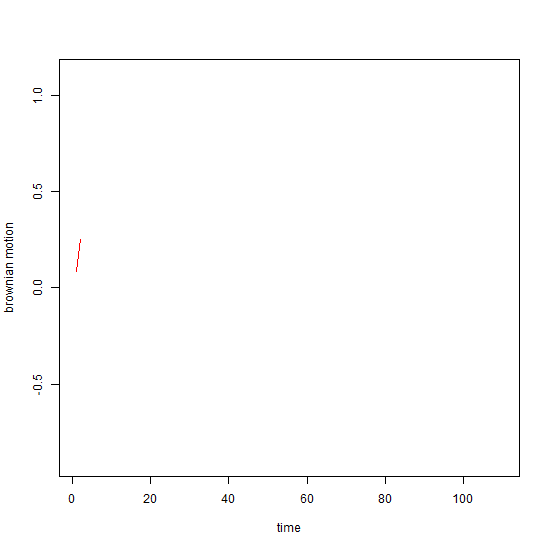

<link rel="stylesheet" href="styles.css" type="text/css">

Welcome to my website! Here you will find a portfolio that describes my passion and the work I have done during my PhD. My research interests include Asset Pricing, Market Microstructure, Experimental Finance and Financial Econometrics. In my JMP, I apply Machine Learning methods to study the dynamics of expected equity returns.

I have recently obtained my PhD degree in Finance from the University of Luxembourg (September, 2020) and I am looking for Postdoc.

I graduated with distinction from the [Vienna University of Economics and Business](https://www.wu.ac.at/studium/master/quantitative-finance/overview/) in a two-year MSc program in Quantitative Finance in 2016. Simultaneously, I was working as researcher in the R&D department at the [Quantitative Asset Manager IQAM](https://www.iqam.com/). Thereafter, I began working towards my PhD in Finance at the [University of Luxembourg, LSF](https://wwwen.uni.lu/research/fdef/luxembourg_school_of_finance_research/people/gabriel_kaiser), in October 2016. As part of my PhD, I spent the summer semester 2019 as research fellow at the [London School of Economics, LSE](https://www.lse.ac.uk/fmg/). If you want to know more about me, please do not hesitate to contact me at any time. 

